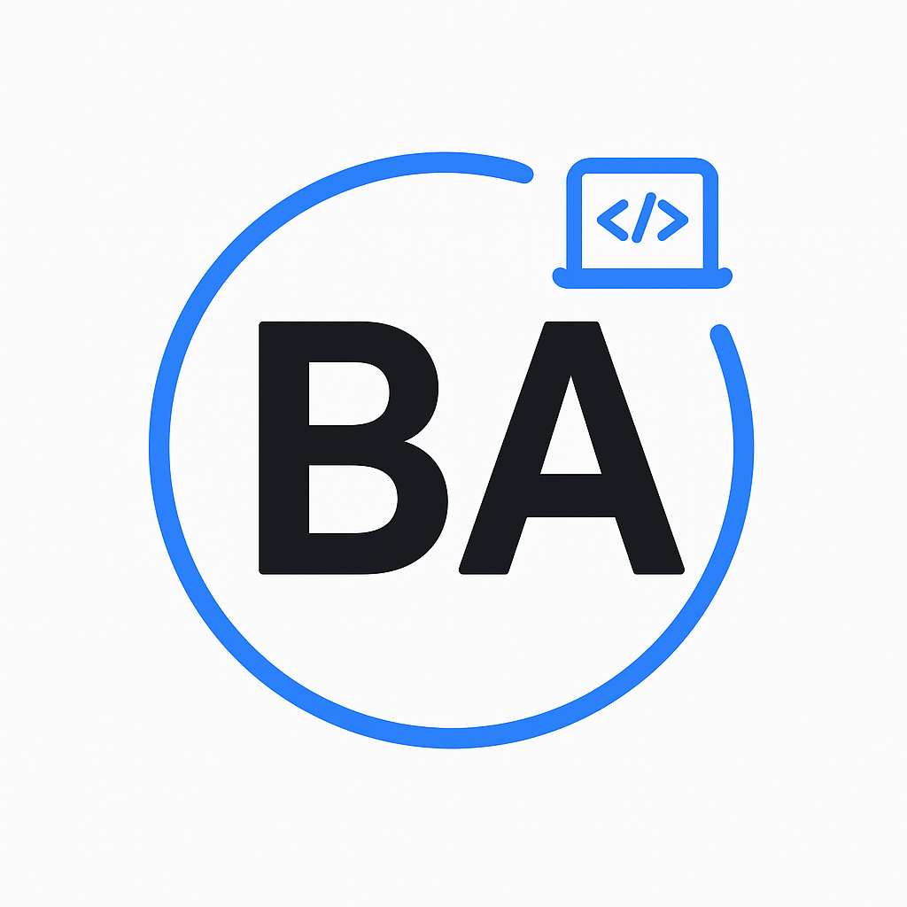

# 🏆 BaysShop - Premium Futsal Shoes E-Commerce

<div align="center">



[](https://mbayuaji.github.io)
[](https://github.com/M-Bayu-Aji/mbayuaji.github.io)
[](LICENSE)

**Modern, Interactive & Responsive E-Commerce Website for Premium Futsal Shoes**

[🌐 Live Demo](https://mbayuaji.github.io) • [📱 Mobile Friendly](https://mbayuaji.github.io) • [⚡ Fast Loading](https://mbayuaji.github.io)

---

</div>

## ✨ Features

### 🎯 Core Features
- **🛒 Smart Shopping Cart** - Add, remove, and manage cart items with local storage
- **🔍 Advanced Search** - Real-time product search with instant results
- **🏷️ Product Filtering** - Filter by categories: New, Popular, Sale, All Products
- **📱 Fully Responsive** - Perfect experience on desktop, tablet, and mobile
- **⚡ Smooth Animations** - Modern CSS animations and transitions
- **📰 Newsletter Subscription** - Stay updated with latest products and offers

### 🎨 Design Features
- **🌟 Glassmorphism Header** - Modern glass effect with backdrop blur
- **🎭 Hero Section** - Dynamic hero with floating animations and product showcase
- **💎 Premium UI/UX** - Clean, modern design with attention to detail
- **🎨 Gradient Effects** - Beautiful color gradients throughout the design
- **📐 Perfect Layout** - Grid and flexbox layouts for optimal content display

### 🚀 Interactive Features
- **📊 Scroll Animations** - Elements animate as you scroll
- **🎯 Active Navigation** - Navigation highlights current section
- **📞 Contact Integration** - Integrated contact form and map
- **⭐ Product Ratings** - Star ratings and review counts
- **💫 Hover Effects** - Interactive hover states on all elements

---

## 🛠️ Technology Stack

<div align="center">

### Frontend Technologies


### Design & Icons


### Development Tools


</div>

---

## 📁 Project Structure

```
BaysShop/
│
├── 📄 index.html          # Main HTML structure
├── 🎨 style.css           # Complete styling with modern CSS
├── ⚙️ script.js           # Interactive JavaScript functionality
│
├── 🖼️ logo_breadcrumbs.png                    # Main logo
├── 🖼️ logo_breadcrumbs_darkmode-removebg-preview.png  # Dark mode logo
├── 👟 sepatu.jpg                              # Product showcase image
│
└── 📖 README.md           # Project documentation
```

---

## 🚀 Quick Start

### Prerequisites
- Modern web browser (Chrome, Firefox, Safari, Edge)
- Internet connection for external resources (fonts, icons)

### Installation

1. **Clone the repository**
   ```bash
   git clone https://github.com/M-Bayu-Aji/WebShop.git
   cd WebShop
   ```

2. **Open in browser**
   ```bash
   # Simply open index.html in your browser
   start index.html
   ```

3. **Or use a local server** (recommended)
   ```bash
   # Using Python
   python -m http.server 8000

   # Using Node.js
   npx serve .

   # Then visit http://localhost:8000
   ```

---

## 📱 Screenshots

<div align="center">

### 🖥️ Desktop View


### 📱 Mobile View


### 🛒 Product Showcase


</div>

---

## 🎯 Key Sections

### 🏠 Hero Section
- **Dynamic Product Showcase** - Featured premium futsal shoes
- **Statistics Display** - 500+ products, 50K+ customers, 4.9 rating
- **Call-to-Action Buttons** - Direct links to shopping platforms
- **Floating Animations** - Interactive background elements

### 🛍️ Products Section
- **Advanced Filtering** - New, Popular, Sale, All Products
- **Product Cards** - Image, rating, price, quick actions
- **Interactive Features** - Add to cart, quick view, compare
- **Responsive Grid** - Adapts to all screen sizes

### 💼 Services Section
- **🚚 Free Shipping** - Free delivery on all orders
- **🔄 Easy Returns** - Hassle-free return policy
- **💳 Secure Payment** - Multiple payment options
- **✅ Quality Guarantee** - Official warranty on all products

### 📞 Contact Section
- **📍 Store Location** - Interactive Google Maps integration
- **📞 Contact Information** - Phone, email, operating hours
- **📝 Contact Form** - Direct customer inquiry form
- **🌐 Social Media** - Links to social platforms

---

## 🎨 Design Highlights

### Color Palette
```css
/* Primary Colors */
--primary-color: #00d4ff;
--secondary-color: #ff6b6b;
--accent-color: #4ecdc4;

/* Neutral Colors */
--dark-bg: #1a1a2e;
--light-bg: #f8f9fa;
--text-primary: #2d3436;
--text-secondary: #636e72;

/* Glassmorphism */
--glass-bg: rgba(255, 255, 255, 0.1);
--glass-border: rgba(255, 255, 255, 0.2);
```

### Typography
- **Primary Font**: Poppins (Google Fonts)
- **Weights Used**: 300, 400, 500, 600, 700
- **Responsive Scaling**: Fluid typography for all devices

### Animations
- **Scroll Animations**: Elements fade in as you scroll
- **Hover Effects**: Interactive feedback on all clickable elements
- **Loading Animations**: Smooth transitions and micro-interactions
- **Floating Elements**: Subtle background animations

---

## 📊 Performance

### ⚡ Loading Speed
- **First Contentful Paint**: < 1.5s
- **Largest Contentful Paint**: < 2.5s
- **Cumulative Layout Shift**: < 0.1
- **Total Bundle Size**: ~150KB (compressed)

### 📱 Mobile Performance
- **Mobile-Friendly**: 100/100 Google Mobile Test
- **Touch Targets**: All buttons meet accessibility standards
- **Responsive Images**: Optimized for all screen sizes

---

## 🔧 Customization

### 🎨 Theme Customization
```javascript
// Change primary color
:root {
  --primary-color: #your-color;
}

// Modify animations
.hero-element {
  animation-duration: 1s; // Adjust timing
}
```

### 📝 Content Updates
1. **Products**: Update product data in `index.html`
2. **Contact Info**: Modify contact details in contact section
3. **Social Links**: Update social media URLs
4. **Images**: Replace with your own product images

---

## 🤝 Contributing

We welcome contributions! Please follow these steps:

1. **Fork the repository**
2. **Create a feature branch**
   ```bash
   git checkout -b feature/amazing-feature
   ```
3. **Commit your changes**
   ```bash
   git commit -m 'Add amazing feature'
   ```
4. **Push to the branch**
   ```bash
   git push origin feature/amazing-feature
   ```
5. **Open a Pull Request**

### 📋 Contribution Guidelines
- Follow existing code style
- Test on multiple browsers
- Ensure mobile responsiveness
- Add comments for complex logic
- Update documentation if needed

---

## 📄 License

This project is licensed under the MIT License - see the [LICENSE](LICENSE) file for details.

```
MIT License

Copyright (c) 2025 M-Bayu-Aji

Permission is hereby granted, free of charge, to any person obtaining a copy
of this software and associated documentation files (the "Software"), to deal
in the Software without restriction, including without limitation the rights
to use, copy, modify, merge, publish, distribute, sublicense, and/or sell
copies of the Software, and to permit persons to whom the Software is
furnished to do so, subject to the following conditions:

The above copyright notice and this permission notice shall be included in all
copies or substantial portions of the Software.
```

---

## 🙏 Acknowledgments

### 🎯 Special Thanks
- **Google Fonts** - For the beautiful Poppins typography
- **Material Symbols** - For the comprehensive icon library
- **Remix Icons** - For additional icon variety
- **Unsplash** - For high-quality stock images

### 🛠️ Tools Used
- **Visual Studio Code** - Primary development environment
- **Git** - Version control system
- **GitHub** - Repository hosting and collaboration
- **Google Chrome DevTools** - Debugging and optimization

---

## 📞 Contact

<div align="center">

**BaysShop Team**

📧 **Email**: info@baysshop.com  
📱 **Phone**: +62 812-3456-7890  
📍 **Location**: Sukabumi, Jawa Barat, Indonesia  
🌐 **Website**: [mbayuaji.github.io](https://mbayuaji.github.io)  
🐙 **GitHub**: [M-Bayu-Aji](https://github.com/M-Bayu-Aji)

---

### 🌟 Connect With Us

[](https://instagram.com/baysshop)
[](https://wa.me/6281234567890)
[](https://facebook.com/baysshop)
[](https://twitter.com/baysshop)

</div>

---

<div align="center">

**Made with ❤️ by [M-Bayu-Aji](https://github.com/M-Bayu-Aji)**

⭐ **Star this repo if you found it helpful!**

[⬆️ Back to Top](#-bayshop---premium-futsal-shoes-e-commerce)

</div>

---

## 📈 Future Enhancements

### 🚀 Planned Features
- [ ] **User Authentication** - Login/register system
- [ ] **Admin Dashboard** - Product management panel
- [ ] **Payment Integration** - Direct payment processing
- [ ] **Order Tracking** - Real-time order status
- [ ] **Wishlist Feature** - Save favorite products
- [ ] **Product Reviews** - Customer review system
- [ ] **Multi-language** - Internationalization support
- [ ] **Dark Mode** - Complete dark theme implementation

### 🔧 Technical Improvements
- [ ] **PWA Support** - Progressive Web App features
- [ ] **SEO Optimization** - Better search engine visibility
- [ ] **Performance** - Code splitting and lazy loading
- [ ] **Accessibility** - WCAG 2.1 AA compliance
- [ ] **Testing** - Unit and integration tests
- [ ] **CI/CD** - Automated deployment pipeline

---

*Last updated: September 14, 2025*</content>